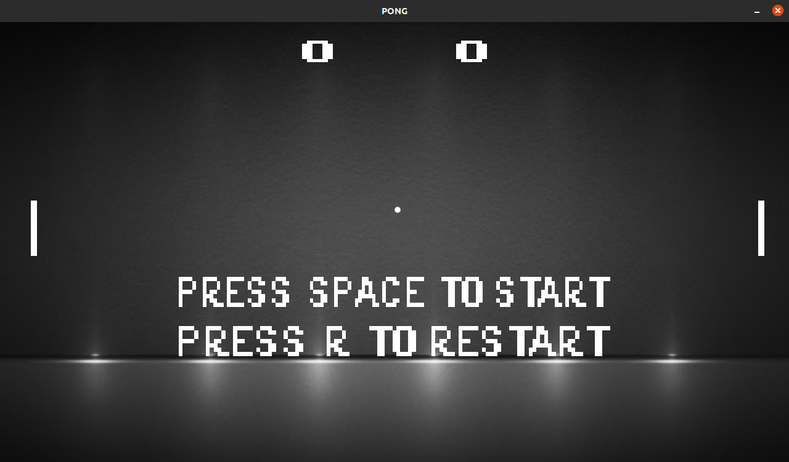

# Pong-Game

Pong game clone using C++ and SDL2.




Instructions to play the game on Linux:

1) Download zip

2) Unzip project
```
unzip Pong-Game-master.zip
```

3) Go to project directory
```
cd Pong-Game-master
```

4) Compile project
```
make
```

5) Run game
```
./out/build/pong-game.out
```
